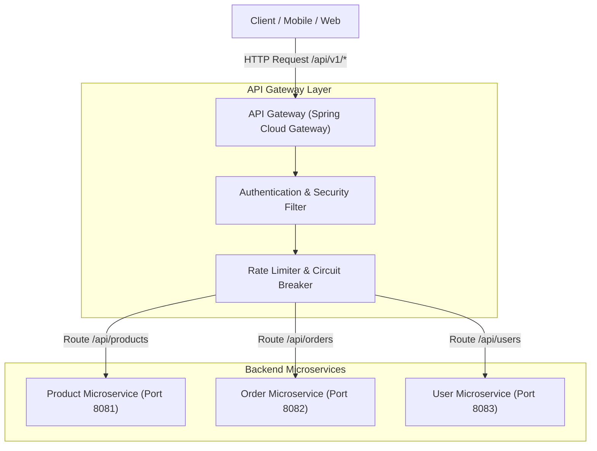
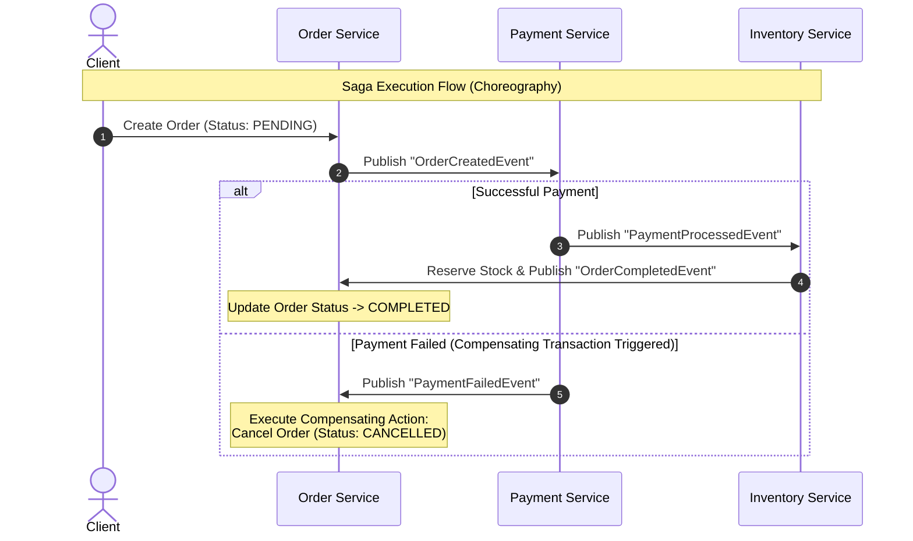
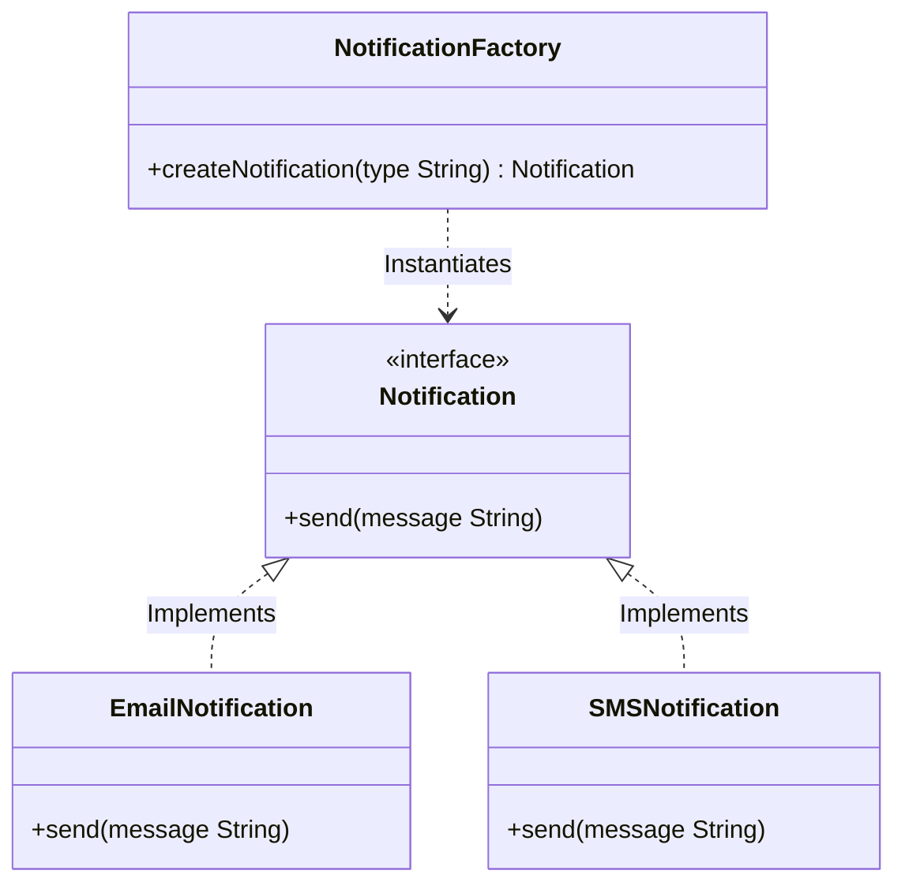
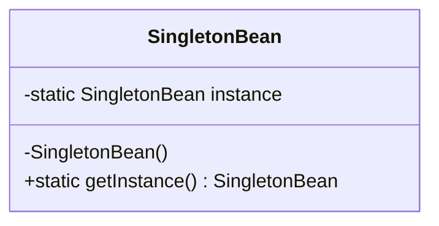
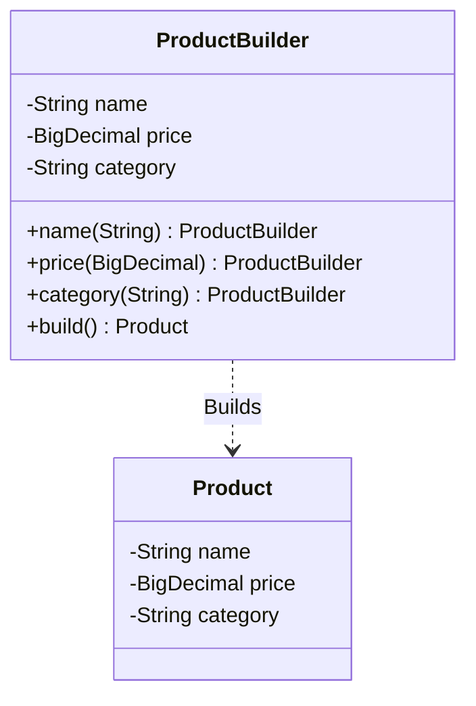

# 🏗️ Design Patterns & Spring Boot Realizations Guide (`DESIGN_PATTERNS.md`)

A comprehensive guide covering key architectural and Gang of Four (GoF) design patterns: **API Gateway**, **Saga Pattern**, **Factory Pattern**, **Singleton Pattern**, and **Builder Pattern**, along with their descriptions, Mermaid flowcharts, and exact Spring Boot equivalents.

---

## 🏛️ 1. Architectural Patterns

### 🌐 1.1 API Gateway Pattern

#### 📌 Description & Purpose
The **API Gateway Pattern** acts as a single entry point for all client requests in a microservices architecture. It abstracts backend service complexities by handling cross-cutting concerns such as request routing, SSL termination, authentication/authorization, rate limiting, and response aggregation.

#### 🔄 Architecture Flowchart


#### 🍃 Spring Boot Equivalent & Features
- **Spring Cloud Gateway:** Provides non-blocking reactive routing built on Spring WebFlux (`RouteLocator`, `GatewayFilter`).
- **Spring Security + OAuth2 Resource Server:** Handled at Gateway level for JWT verification.
- **Resilience4j Gateway Filters:** Rate limiting (`RequestRateLimiter`) and Circuit Breaker routing (`CircuitBreaker`).

---

### 🔄 1.2 Saga Pattern (Distributed Transactions)

#### 📌 Description & Purpose
In microservices, each service manages its own isolated database. Since traditional 2PC (Two-Phase Commit) transactions do not scale well, the **Saga Pattern** manages distributed transactions as a sequence of local transactions. If a step fails, compensating transactions are executed in reverse order to rollback changes.

#### 🔄 Architecture Flowchart (Choreography vs Orchestration)


#### 🍃 Spring Boot Equivalent & Features
- **Spring Kafka / Spring Cloud Stream:** Event-driven messaging for Saga Event publishing (`@KafkaListener`, `KafkaTemplate`).
- **Axon Framework / Temporal:** Orchestration engine frameworks for managing Saga workflows in Java.

---

## 🧩 2. Gang of Four (GoF) Creational Design Patterns

### 🏭 2.1 Factory Pattern (Factory Method / Abstract Factory)

#### 📌 Description & Purpose
The **Factory Pattern** provides an interface for creating objects in a superclass, but allows subclasses to alter the type of objects that will be created. It encapsulates object instantiation logic away from client code.

#### 🔄 Architecture Flowchart


#### 🍃 Spring Boot Equivalent & Features
- **Spring `BeanFactory` / `ApplicationContext`:** Spring's IoC Container is a massive Implementation of the Abstract Factory Pattern.
- **Service Locator via Map Injection:** Spring automatically populates a `Map<String, ServiceInterface>` bean factory map:
  ```java
  @Autowired
  private Map<String, NotificationService> notificationServices;
  ```

---

### 🔒 2.2 Singleton Pattern

#### 📌 Description & Purpose
The **Singleton Pattern** ensures that a class has only one instance in the application lifetime and provides a global point of access to that instance.

#### 🔄 Architecture Flowchart


#### 🍃 Spring Boot Equivalent & Features
- **Spring Bean Default Scope (`@Scope("singleton")`)**: By default, every bean managed by the Spring IoC Container (`@Component`, `@Service`, `@Bean`) is created once per Spring `ApplicationContext`.
- **Note:** A Spring Singleton is *one instance per Spring Container context*, whereas a classic GoF Singleton is *one instance per JVM ClassLoader*.

---

### 🏗️ 2.3 Builder Pattern

#### 📌 Description & Purpose
The **Builder Pattern** separates the construction of a complex object from its representation, allowing the same construction process to create different representations step-by-step.

#### 🔄 Architecture Flowchart


#### 🍃 Spring Boot Equivalent & Features
- **Lombok `@Builder`:** Annotates DTOs or Entities to automatically generate fluent builder methods.
- **Spring Framework Builders:**
  - `UriComponentsBuilder.fromHttpUrl(...)`
  - `TopicBuilder.name("my-topic").partitions(5).build()`
  - `ChatClient.builder().build()` (Spring AI)
  - `WebClient.builder().build()`

---

## 📊 Summary Comparison Table

| Design Pattern | Category | Core Purpose | Spring Boot Realization / Equivalent |
|---|---|---|---|
| **API Gateway** | Architectural | Unified routing, security, and rate-limiting entry point | **Spring Cloud Gateway** (`RouteLocator`) |
| **Saga Pattern** | Architectural | Distributed transaction management & compensation | **Spring Kafka** (`KafkaTemplate`, `@KafkaListener`) + Event Sourcing |
| **Factory Pattern** | Creational (GoF) | Encapsulates object instantiation logic | **`ApplicationContext` / `BeanFactory`** & `Map<String, Bean>` injection |
| **Singleton Pattern** | Creational (GoF) | Guarantees single instance creation | **Default Spring Bean Scope** (`@Scope("singleton")`) |
| **Builder Pattern** | Creational (GoF) | Step-by-step fluent construction of complex objects | **Lombok `@Builder`**, `UriComponentsBuilder`, `TopicBuilder` |
