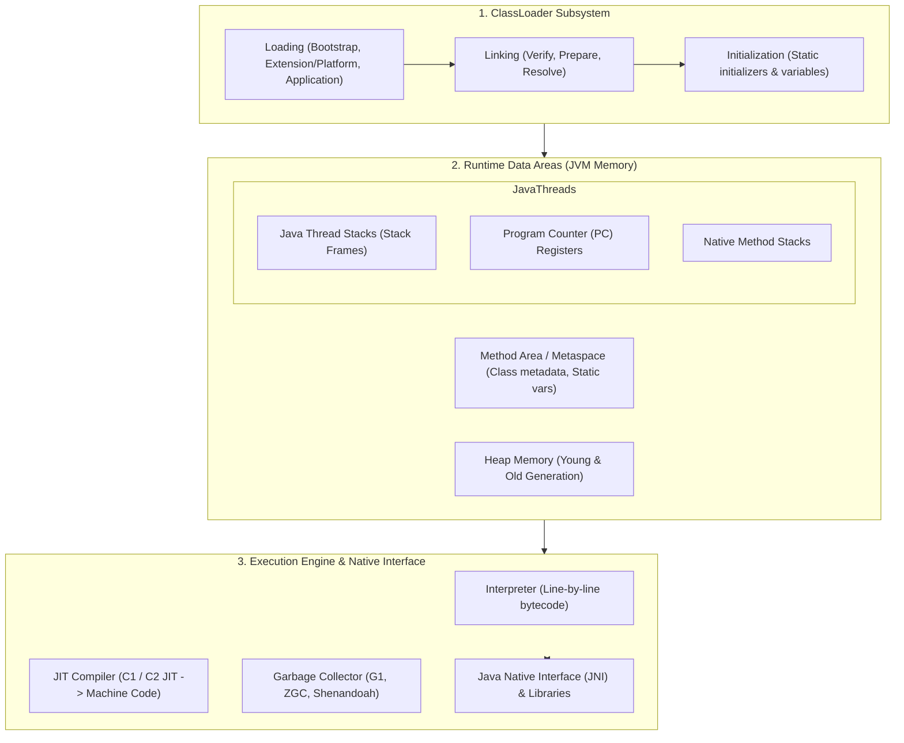
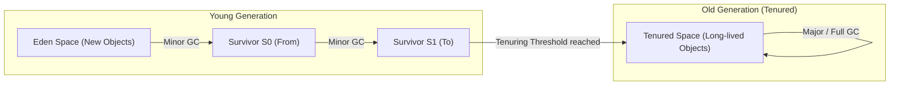

# ☕ Java Virtual Machine (JVM) Architecture & Core Concepts Guide

A comprehensive learning guide covering **JVM Architecture**, **Memory Structure**, **Garbage Collection (GC)**, **Execution Engine**, **JVM Tuning**, and **Top Interview Questions**.

---

## 🏛️ 1. JVM High-Level Architecture

The Java Virtual Machine (JVM) is an abstract computing machine that enables a computer to run Java programs. It consists of three primary subsystems:
1. **ClassLoader Subsystem** — Loads, links, and initializes `.class` files.
2. **Runtime Data Areas (JVM Memory)** — Stores program data during execution.
3. **Execution Engine & Native Interface** — Executes bytecode and interacts with OS native libraries.



---

## 🧠 2. JVM Memory Structure Breakdown

| Memory Region | Shared / Private | Purpose | Primary Errors / Exceptions |
|---|---|---|---|
| **Heap Memory** | **Shared** across all threads | Stores all object instances and arrays created via `new`. Divided into **Young Generation** (Eden, S0, S1) and **Old (Tenured) Generation**. | `java.lang.OutOfMemoryError: Java heap space` |
| **Metaspace (Method Area)** | **Shared** across all threads | Stores class metadata, bytecode, method structures, and static variables. Located in native OS memory (replaced PermGen in Java 8). | `java.lang.OutOfMemoryError: Metaspace` |
| **Java Thread Stack** | **Thread-Private** (Per thread) | Stores local variables, method call frames, and intermediate operands. | `java.lang.StackOverflowError` |
| **PC Register** | **Thread-Private** (Per thread) | Stores the memory address of the JVM instruction currently executing. | N/A |
| **Native Method Stack** | **Thread-Private** (Per thread) | Holds native C/C++ method call frames invoked via JNI. | `java.lang.StackOverflowError` |

---

## 🗑️ 3. Garbage Collection (GC) Generations & Process



### Key Collectors:
- **G1 GC (Garbage-First):** Default collector for server applications. Splits heap into equal regions and prioritizes regions with the most garbage.
- **ZGC (Z Garbage Collector):** Low-latency collector designed for huge heaps (GBs to TBs) with sub-millisecond pause times.
- **Shenandoah GC:** Ultra-low pause time collector that performs concurrent compaction alongside application threads.

---

## 💡 4. Top JVM Interview Questions & Answers

### Q1: What is the difference between JDK, JRE, and JVM?
- **JVM (Java Virtual Machine):** The abstract execution engine that runs compiled Java bytecode (`.class` files).
- **JRE (Java Runtime Environment):** JVM + core Java class libraries required to run Java applications.
- **JDK (Java Development Kit):** JRE + development tools (`javac` compiler, debugger, documentation tools, etc.).

### Q2: What causes `StackOverflowError` vs `OutOfMemoryError`?
- **`StackOverflowError`:** Occurs when thread execution stack memory is exhausted (e.g. infinite or un-terminated deep recursion).
- **`OutOfMemoryError`:** Occurs when the heap or metaspace runs out of memory to allocate new objects or class definitions, and GC cannot reclaim enough memory.

### Q3: What is JIT (Just-In-Time) compilation and how does it optimize execution?
JIT compiler compiles frequently executed bytecode instructions ("hot spots") into native machine code at runtime. It employs optimizations like **method inlining**, **loop unrolling**, and **escape analysis** (allocating stack objects instead of heap).

### Q4: What is the difference between Minor GC, Major GC, and Full GC?
- **Minor GC:** Collects garbage only from the **Young Generation** (Eden + Survivor spaces). Fast and frequent.
- **Major GC:** Collects garbage from the **Old Generation**.
- **Full GC:** Cleans the entire heap (Young + Old generations + Metaspace). Triggers a "Stop-The-World" (STW) pause.

---

## ⚡ 5. Useful JVM Tuning Flags

```bash
# Set initial (Xms) and maximum (Xmx) heap size
java -Xms2g -Xmx4g -jar app.jar

# Set Garbage Collector to G1GC or ZGC
java -XX:+UseG1GC -jar app.jar
java -XX:+UseZGC -jar app.jar

# Dump heap memory to file on OutOfMemoryError for troubleshooting
java -XX:+HeapDumpOnOutOfMemoryError -XX:HeapDumpPath=/var/logs/heapdump.hprof -jar app.jar
```
