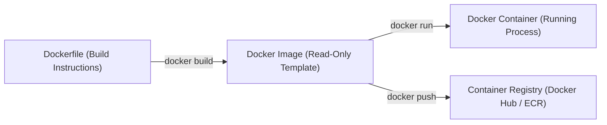

# 🐳 Cloud-Native Infrastructure & Caching Guide (Docker, Kubernetes & Redis)

A comprehensive guide covering **Containerization (Docker)**, **Container Orchestration (Kubernetes)**, and **In-Memory Caching (Redis)**.

---

## 🏛️ 1. Infrastructure Architecture & Data Flow

```mermaid
flowchart TD
    Client(["HTTP Client / Browser"])

    subgraph K8sCluster["Kubernetes Cluster"]
        Ingress["K8s Ingress (Nginx / ALB)"]
        K8sService["K8s ClusterIP Service"]
        
        Pod1["SpringBoot Pod 1"]
        Pod2["SpringBoot Pod 2"]
        Pod3["SpringBoot Pod 3"]
    end

    subgraph StorageLayer["Data & Caching Layer"]
        RedisCache[("Redis Cluster (In-Memory Cache)")]
        Database[("Relational Database (Oracle / PostgreSQL)")]
    end

    Client -->|HTTP / HTTPS Request| Ingress
    Ingress -->|Route Traffic| K8sService
    K8sService -->|Load Balance| Pod1
    K8sService -->|Load Balance| Pod2
    K8sService -->|Load Balance| Pod3

    Pod1 -->|1. Cache Read/Write| RedisCache
    Pod1 -->|2. DB Query (Cache Miss)| Database
    Pod2 -->|1. Cache Read/Write| RedisCache
    Pod2 -->|2. DB Query (Cache Miss)| Database
    Pod3 -->|1. Cache Read/Write| RedisCache
    Pod3 -->|2. DB Query (Cache Miss)| Database
```

---

## 🐋 2. Docker & Containerization Overview

Docker packages applications and their dependencies into lightweight, portable container images.



### Essential Docker Commands:
```bash
# Build Docker image
docker build -t springboot-api:latest .

# Run container in background mapping port 8080
docker run -d -p 8080:8080 --name my-app springboot-api:latest

# View container logs
docker logs -f my-app
```

---

## ☸️ 3. Kubernetes (K8s) Architecture & Concepts

| Resource | Description |
|---|---|
| **Pod** | Smallest deployable execution unit in Kubernetes containing one or more containers sharing network namespace. |
| **Deployment** | Manages declarative updates, scaling, and rolling updates for a set of identical Pods. |
| **Service** | Provides a stable virtual IP address and load balancer to expose a set of Pods internally or externally. |
| **ConfigMap / Secret** | Separates configuration artifacts and sensitive passwords/keys from container image code. |

### Essential `kubectl` Commands Cheat Sheet:

```bash
# ── Cluster & Node Inspection ────────────────────────────────────────────────
kubectl cluster-info                           # View cluster master/services status
kubectl get nodes -o wide                      # List nodes with IP, OS, and runtime

# ── Resource Inspection & Monitoring ─────────────────────────────────────────
kubectl get pods                               # List all pods in current namespace
kubectl get pods -A                            # List all pods across all namespaces
kubectl get deployments                        # List all deployments
kubectl get services                           # List all services (SVC)
kubectl describe pod <pod-name>                # Detailed diagnostics & events for a pod
kubectl get events --sort-by='.metadata.creationTimestamp' # View cluster events sorted by time

# ── Pod Debugging & Logs ─────────────────────────────────────────────────────
kubectl logs -f <pod-name>                     # Stream live logs from a pod container
kubectl logs <pod-name> --previous             # View logs from a crashed/restarted container
kubectl exec -it <pod-name> -- /bin/bash       # Open interactive shell inside a running pod

# ── Deploying & Applying Configurations ──────────────────────────────────────
kubectl apply -f deployment.yaml              # Create or update resources declaratively
kubectl delete -f deployment.yaml             # Delete resources defined in YAML file

# ── Scaling & Rolling Updates ────────────────────────────────────────────────
kubectl scale deployment/my-app --replicas=5   # Dynamically scale deployment to 5 pods
kubectl rollout status deployment/my-app       # Check progress of a deployment update
kubectl rollout undo deployment/my-app         # Rollback deployment to previous revision
kubectl port-forward svc/my-app-service 8080:8080 # Forward local port to cluster service
```

---

## 🔴 4. Redis Cache & Data Structures

Redis is an in-memory key-value data store used as a database, cache, message broker, and streaming engine.

| Data Structure | Use Case |
|---|---|
| **Strings** | Simple key-value caching (e.g., user session, JSON payload caching). |
| **Hashes** | Storing objects with field-value pairs (e.g., User profiles `HSET user:100 name "John"`). |
| **Lists** | Queues and message logs (`LPUSH` / `RPOP`). |
| **Sets / Sorted Sets** | Unique collections, leaderboards, and rate limiters (`ZADD` / `ZRANGE`). |
| **Pub/Sub & Streams** | Real-time messaging and event broadcasting. |

---

## 💡 5. Top DevOps & Infrastructure Interview Questions

### Q1: What is the Cache-Aside (Lazy Loading) pattern in Redis?
1. Application receives a read request.
2. Checks Redis cache first (**Cache Hit** → Return cached data).
3. If not in Redis (**Cache Miss**), query primary Database.
4. Write fetched data to Redis with a TTL (Time-To-Live) and return data to client.

### Q2: What is the difference between Docker `CMD` and `ENTRYPOINT`?
- **`ENTRYPOINT`:** Sets the default command that will **always execute** when the container starts.
- **`CMD`:** Sets default arguments passed to `ENTRYPOINT` which can be easily overridden at runtime via `docker run`.

### Q3: How do Kubernetes Liveness and Readiness Probes differ?
- **Liveness Probe:** Checks if container is alive. If failed, Kubernetes kills and restarts the Pod container.
- **Readiness Probe:** Checks if container is ready to accept HTTP traffic. If failed, Kubernetes removes Pod from Service load balancer endpoints.
