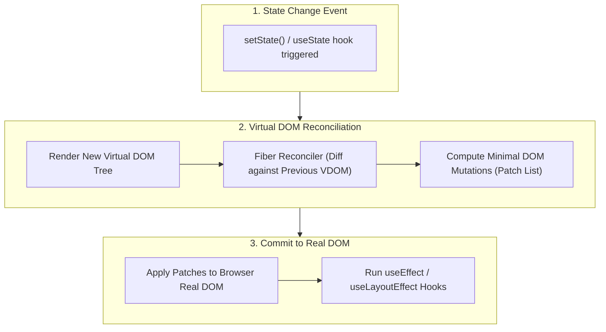
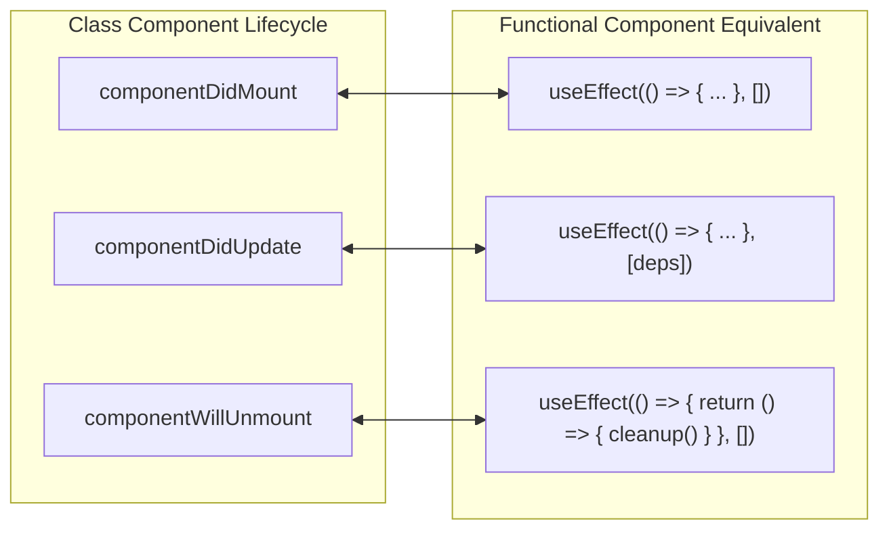

# ⚛️ React.js & Modern Frontend Ecosystem Guide

A comprehensive learning guide covering **React Hooks**, **State Management**, **Component Lifecycle**, **Virtual DOM Rendering**, and **Architecture Patterns**.

---

## 🏛️ 1. React Architecture & Virtual DOM Render Flow

React uses a **Virtual DOM (VDOM)** to optimize UI updates. When state or props change, React constructs a new Virtual DOM tree, compares it with the previous VDOM tree (**Reconciliation / Diffing Algorithm**), and computes the minimal set of real DOM updates (**Batch Commits**).

---

## 🪝 2. Essential React Hooks Reference

| Hook | Category | Description & Usage |
|---|---|---|
| `useState(initialState)` | **State** | Declares a local state variable and a setter function to trigger re-renders. |
| `useEffect(fn, deps)` | **Side Effects** | Runs side effects (data fetching, subscriptions, timers) after render based on dependency array. |
| `useContext(Context)` | **Context** | Subscribes to global React Context to consume shared state without prop-drilling. |
| `useReducer(reducer, init)` | **State** | Manages complex local state logic via action dispatches (Redux pattern). |
| `useMemo(fn, deps)` | **Performance** | Memoizes expensive calculation results to prevent recalculation on every render. |
| `useCallback(fn, deps)` | **Performance** | Memoizes callback function instances to prevent unnecessary child component re-renders. |
| `useRef(initialValue)` | **Ref** | Persists a mutable reference value or DOM element ref across renders without triggering a re-render. |

---

## 🔄 3. Component Lifecycle vs Hooks Equivalent

---

## 💡 4. Top React Interview Questions & Answers

### Q1: What is the Virtual DOM and how does the Diffing algorithm work?
The Virtual DOM is a lightweight in-memory representation of the actual DOM. React uses the **Fiber Reconciler algorithm** ($O(N)$ heuristic) to compare the new VDOM tree with the old VDOM tree. It assumes:
1. Two elements of different types will produce different trees.
2. The developer can hint at stable child elements using a unique `key` prop.

### Q2: What is Prop Drilling and how do you solve it?
Prop drilling occurs when data is passed down through multiple intermediate component levels that do not need the data themselves.
**Solutions:**
- React **Context API** (`createContext` / `useContext`)
- State Management Libraries (**Redux Toolkit**, **Zustand**, **Recoil**)
- Component Composition (passing components as `children`).

### Q3: What is the difference between `useEffect` and `useLayoutEffect`?
- **`useEffect`:** Runs asynchronously **after** the browser paints the screen. Ideal for data fetching and event listeners.
- **`useLayoutEffect`:** Runs synchronously **before** the browser paints. Ideal for measuring DOM layout or mutating DOM elements to prevent visual flickers.
