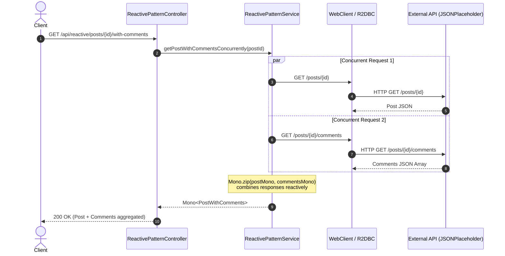
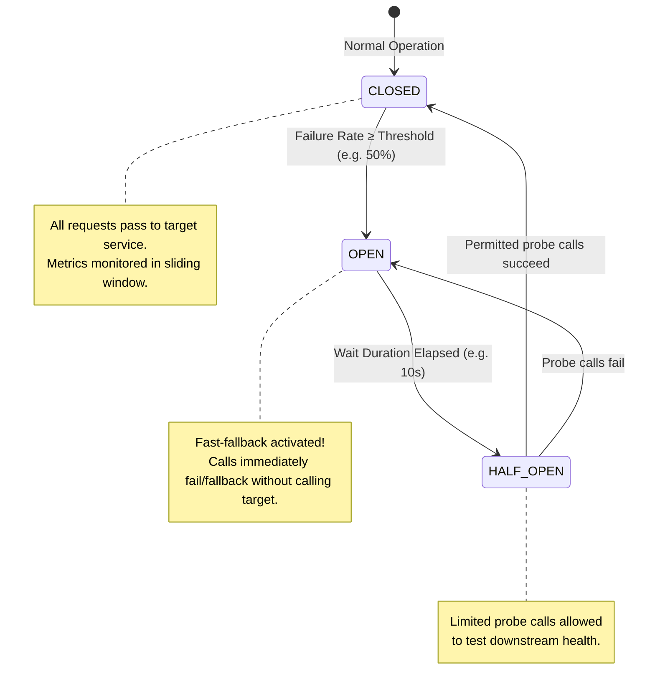
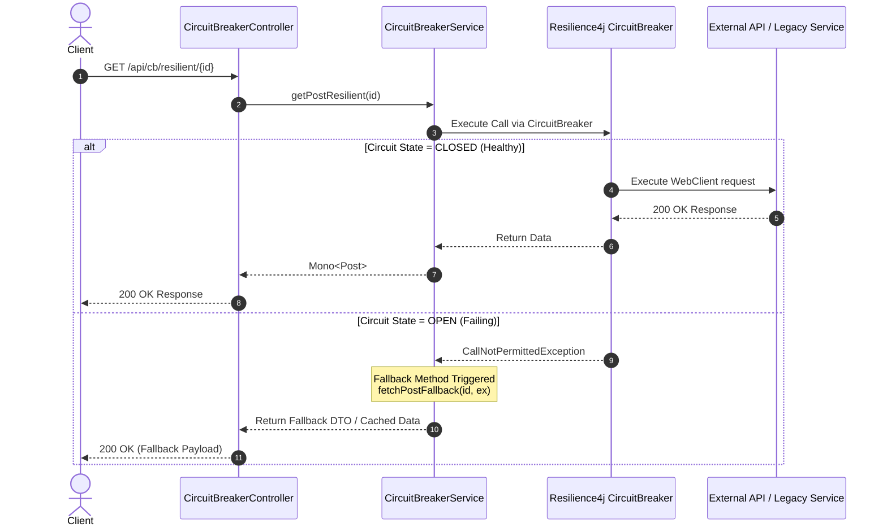
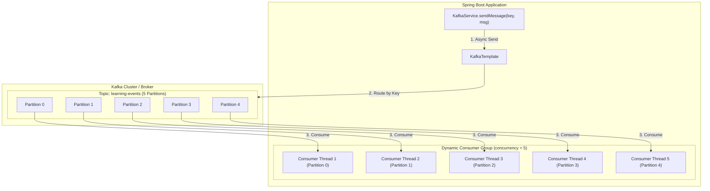

# springbootpractice

A hands-on Spring Boot learning project demonstrating **Reactive REST API**, **Spring WebFlux**, **R2DBC**, **Circuit Breaker**, **Swagger/OpenAPI**, and **Spring Boot Actuator** — all in one codebase.

---

## 📚 What This Project Covers

| Area | Technology |
|---|---|
| Web Framework | Spring WebFlux (reactive, non-blocking) |
| AI Integration | **Spring AI** + **Anthropic Claude LLM** (`claude-3-5-sonnet`) |
| Event Messaging | **Spring Kafka** (`KafkaTemplate`, `KafkaListener`, `TopicBuilder`) |
| Reactive HTTP Client | WebClient |
| Reactive Database | Spring Data R2DBC + H2 In-Memory |
| Circuit Breaker | Resilience4j (`@CircuitBreaker` + operator) |
| API Documentation | Springdoc OpenAPI 3 + Swagger UI |
| Monitoring | Spring Boot Actuator (14 endpoints) |
| Build Tool | Maven (wrapper included) |
| Java Version | 17+ |

---

## 🚀 Quick Start

### Prerequisites
- Java 17 or higher
- No Maven installation needed — the project includes `mvnw` wrapper

### Run the application
```bash
git clone https://github.com/<your-username>/springbootpractice.git
cd springbootpractice
export ANTHROPIC_API_KEY=your_claude_api_key_here
./mvnw spring-boot:run
```

### Access the APIs
| URL | Description |
|---|---|
| http://localhost:8080/swagger-ui.html | **Swagger UI** — explore all endpoints |
| http://localhost:8080/v3/api-docs | OpenAPI JSON spec |
| http://localhost:8080/actuator | Actuator endpoints list |
| http://localhost:8080/actuator/health | Health check |
| http://localhost:8080/actuator/circuitbreakers | Circuit breaker metrics |

---

## 🗂️ Project Structure

```
src/main/java/com/learn/restapi/
├── RestApiApplication.java            # Entry point
│
├── config/
│   ├── R2dbcConfig.java               # R2DBC auditing + reactive DB config
│   ├── SwaggerConfig.java             # OpenAPI info, tags, servers
│   ├── WebClientConfig.java           # WebClient bean + RestTemplate bean + ExecutorService
│   └── KafkaConfig.java               # Spring Kafka producer/consumer & topic config
│
├── controller/
│   ├── ProductController.java         # CRUD REST API (reactive)
│   ├── ReactivePatternController.java # /api/reactive — 7 reactive patterns
│   ├── CircuitBreakerController.java  # /api/cb      — 7 circuit breaker patterns
│   └── AiController.java              # /api/ai      — Spring AI Claude integration
│
├── service/
│   ├── ProductService.java            # Reactive CRUD business logic
│   ├── ReactivePatternService.java    # Pure WebFlux + WebClient patterns
│   ├── CircuitBreakerService.java     # Blocking RestTemplate + @CircuitBreaker
│   ├── AiService.java                 # ChatClient Claude completion & streaming
│   └── KafkaService.java              # Kafka Producer (KafkaTemplate) & Consumer (@KafkaListener)

│
├── model/
│   ├── Product.java                   # R2DBC entity (reactive DB)
│   ├── Post.java                      # DTO — JSONPlaceholder post
│   ├── PostComment.java               # DTO — JSONPlaceholder comment
│   └── PostWithComments.java          # Aggregated DTO (post + comments)
│
├── repository/
│   └── ProductRepository.java         # ReactiveCrudRepository<Product, Long>
│
└── exception/
    └── ResourceNotFoundException.java # Custom 404 exception

src/main/resources/
├── application.properties             # App config (R2DBC, Actuator, Resilience4j, Spring AI)
└── schema.sql                         # DDL — creates PRODUCT table on startup
```

---

## 📊 Architecture & Flow Diagrams

### 1. Reactive Patterns Flow (`ReactivePatternController` → `ReactivePatternService` → `WebClient`)



---

### 2. Circuit Breaker State Machine & Flow (`CircuitBreakerController` → `CircuitBreakerService` → `Resilience4j`)





---

### 3. Kafka Event Streaming Flow (`KafkaConfig` ↔ `KafkaService` ↔ Kafka Broker)



---

## 🤖 Spring AI (Anthropic Claude LLM) (`/api/ai`)

Integration using `ChatClient` from **Spring AI** connecting to Claude models (`claude-3-5-sonnet`).

| Method | URL | Description |
|---|---|---|
| `GET` | `/api/ai/generate?prompt=...` | Single completion from Claude (`Mono<Map>`) |
| `GET` | `/api/ai/stream?prompt=...` | Token streaming via Server-Sent Events (`Flux<String>`) |

---

## 📦 API Reference

### 1. Products — Reactive CRUD (`/api/products`)

Full reactive CRUD with H2 in-memory database via R2DBC.

| Method | URL | Description |
|---|---|---|
| `GET` | `/api/products` | Get all products (Flux stream) |
| `GET` | `/api/products/{id}` | Get product by ID |
| `POST` | `/api/products` | Create a new product |
| `PUT` | `/api/products/{id}` | Update product |
| `DELETE` | `/api/products/{id}` | Delete product |

**Sample request body (POST / PUT):**
```json
{
  "name": "Laptop",
  "description": "Gaming laptop",
  "price": 1299.99,
  "quantity": 5
}
```

---

### 2. Reactive Patterns (`/api/reactive`)

Pure reactive programming using **WebClient + Project Reactor**. No circuit breakers — each endpoint demonstrates exactly one reactive pattern against [JSONPlaceholder](https://jsonplaceholder.typicode.com).

| Method | URL | Reactive Pattern |
|---|---|---|
| `GET` | `/api/reactive/posts` | **Pattern 1** — Basic `Flux`: `bodyToFlux(T)` |
| `GET` | `/api/reactive/posts/{id}` | **Pattern 2** — `Mono` + `timeout()` + `onStatus()` |
| `GET` | `/api/reactive/posts/user/{userId}` | **Pattern 3** — `retryWhen(Retry.backoff(...).jitter(...))` |
| `GET` | `/api/reactive/posts/{id}/with-comments` | **Pattern 4** — `Mono.zip()` (concurrent fetch) |
| `POST` | `/api/reactive/posts/batch` | **Pattern 5** — `flatMap(fn, concurrency=5)` (parallel fan-out) |
| `GET` | `/api/reactive/blocking` | **Pattern 6** — `Mono.fromCallable` + `subscribeOn(customExecutor)` |
| `GET` | `/api/reactive/blocking/bounded-elastic` | **Pattern 7** — `subscribeOn(Schedulers.boundedElastic())` |

**Pattern 4 example — concurrent fetch:**
```
Mono.zip(
    GET /posts/{id},          // runs simultaneously
    GET /posts/{id}/comments  // runs simultaneously
)
// Latency = max(t_post, t_comments), NOT t_post + t_comments
```

**Pattern 5 example:**
```bash
curl -X POST http://localhost:8080/api/reactive/posts/batch \
  -H "Content-Type: application/json" \
  -d "[1, 5, 10, 20, 50]"
```

---

### 3. Circuit Breaker Patterns (`/api/cb`)

Traditional **blocking REST API** style using `RestTemplate` + Resilience4j `@CircuitBreaker` annotation.

| Method | URL | Pattern |
|---|---|---|
| `GET` | `/api/cb/posts` | **CB-1** — Basic `@CircuitBreaker` with fallback |
| `GET` | `/api/cb/posts/{id}` | **CB-2** — 404 ignored, network errors trip CB |
| `GET` | `/api/cb/posts/user/{userId}` | **CB-3** — Failure accumulation |
| `GET` | `/api/cb/posts/{id}/with-comments` | **CB-4** — Two sequential calls in one CB scope |
| `POST` | `/api/cb/posts/batch` | **CB-5** — Loop of blocking calls under one CB |
| `GET` | `/api/cb/blocking` | **CB-6** — Separate `blockingApi` CB instance |
| `GET` | `/api/cb/status` | **CB-7** — Live metrics for both CB instances |

**How `@CircuitBreaker` works:**
```java
@CircuitBreaker(name = "externalApi", fallbackMethod = "getAllPostsFallback")
public List<Post> getAllPosts() {
    return restTemplate.getForObject("/posts", Post[].class); // blocking
}

// Fallback: same return type + Exception at the end
private List<Post> getAllPostsFallback(Exception ex) {
    return List.of(new Post(0, 0, "[FALLBACK]", ex.getMessage()));
}
```

**Circuit Breaker State Machine:**
```
CLOSED ──(failures ≥ threshold)──▶ OPEN ──(waitDuration)──▶ HALF_OPEN
HALF_OPEN ──(probes pass)─────────▶ CLOSED
HALF_OPEN ──(probes fail)─────────▶ OPEN
```

---

## ⚙️ Configuration

Key settings in [`src/main/resources/application.properties`](src/main/resources/application.properties):

```properties
# R2DBC — Reactive H2 In-Memory DB
spring.r2dbc.url=r2dbc:h2:mem:///productdb

# Actuator — expose all endpoints
management.endpoints.web.exposure.include=*
management.endpoint.health.show-details=always

# Swagger UI
springdoc.swagger-ui.path=/swagger-ui.html

# Resilience4j — externalApi circuit breaker
resilience4j.circuitbreaker.instances.externalApi.sliding-window-size=5
resilience4j.circuitbreaker.instances.externalApi.failure-rate-threshold=60
resilience4j.circuitbreaker.instances.externalApi.wait-duration-in-open-state=15s

# Resilience4j — blockingApi circuit breaker (separate instance)
resilience4j.circuitbreaker.instances.blockingApi.sliding-window-size=10
resilience4j.circuitbreaker.instances.blockingApi.wait-duration-in-open-state=20s
```

---

## 🔬 Key Concepts

### Reactive vs Blocking — When to use what

| | Reactive (WebFlux) | Blocking (RestTemplate) |
|---|---|---|
| Thread model | Non-blocking (Netty event loop) | Thread-per-request |
| HTTP client | `WebClient` | `RestTemplate` |
| Return types | `Mono<T>` / `Flux<T>` | `T` / `List<T>` |
| DB access | R2DBC (reactive) | JPA/JDBC (blocking) |
| Best for | High concurrency, streaming | Simple CRUD, legacy systems |

### Reactive Operators Cheat Sheet

```java
// Stream all items
webClient.get().retrieve().bodyToFlux(Post.class)

// Single item with timeout
webClient.get().retrieve().bodyToMono(Post.class)
    .timeout(Duration.ofSeconds(5))

// Retry on failure
.retryWhen(Retry.backoff(3, Duration.ofMillis(500)).jitter(0.5))

// Two calls concurrently
Mono.zip(monoA, monoB).map(tuple -> combine(tuple.getT1(), tuple.getT2()))

// N calls in parallel, cap concurrency
Flux.fromIterable(ids).flatMap(id -> fetch(id), 5)

// Blocking code off event loop
Mono.fromCallable(() -> blockingFn())
    .subscribeOn(Schedulers.boundedElastic())
```

### Circuit Breaker Annotation Rules

```java
// 1. Annotate the service method
@CircuitBreaker(name = "instanceName", fallbackMethod = "myFallback")
public List<Post> myMethod(int param) { ... }

// 2. Fallback MUST have:
//    - Same return type
//    - Same parameters as original method
//    - Exception as the last parameter
private List<Post> myFallback(int param, Exception ex) { ... }
```

---

## 🏥 Actuator Endpoints

| Endpoint | Description |
|---|---|
| `/actuator/health` | Application health (includes CB status) |
| `/actuator/info` | Application info |
| `/actuator/metrics` | All available metrics |
| `/actuator/circuitbreakers` | Resilience4j CB metrics |
| `/actuator/circuitbreakerevents` | CB state transition history |
| `/actuator/env` | Environment properties |
| `/actuator/mappings` | All registered request mappings |
| `/actuator/httptrace` | Recent HTTP request traces |

---

## 🧪 Running Tests

```bash
./mvnw test
```

Tests use Spring Boot Test with an embedded H2 database and test WebClient.

---

## 🛠️ Tech Stack

| Dependency | Version | Purpose |
|---|---|---|
| Spring Boot | 3.3.2 | Parent framework |
| Spring WebFlux | managed | Reactive web layer (Netty) |
| Spring Data R2DBC | managed | Reactive database access |
| R2DBC H2 | managed | In-memory reactive DB driver |
| H2 Database | managed | In-memory SQL database |
| Resilience4j | 2.2.0 | Circuit breaker |
| Springdoc OpenAPI | 2.6.0 | Swagger UI (WebFlux edition) |
| Spring Boot Actuator | managed | Monitoring & health |
| Spring Boot Validation | managed | Bean validation (`@Valid`) |
| Spring Boot AOP | managed | Proxy for `@CircuitBreaker` |
| Reactor Test | managed | `StepVerifier` for reactive testing |

---

## 📖 Learning Path

If you're using this project to learn, follow this order:

1. **`ProductController`** → Basic reactive CRUD (simplest starting point)
2. **`ReactivePatternController` Pattern 1–2** → Flux/Mono basics
3. **`ReactivePatternController` Pattern 3** → Error handling + retry
4. **`ReactivePatternController` Pattern 4** → Concurrent composition with `Mono.zip`
5. **`ReactivePatternController` Pattern 5** → Parallel fan-out with `flatMap`
6. **`ReactivePatternController` Pattern 6–7** → Blocking interop
7. **`CircuitBreakerController`** → Circuit breaker patterns

---

## 📝 License

This project is for learning purposes. Feel free to use and modify.
