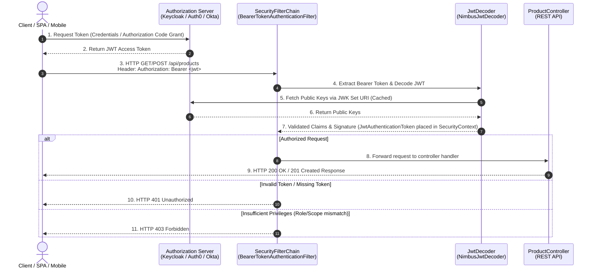

# Spring Security Configuration with OAuth2 + JWT (Standard Servlet / Non-Reactive)

This document provides a comprehensive guide to configuring **standard Servlet-based Spring Security with OAuth2 Resource Server & JWT validation** to secure REST APIs like `ProductController`.

---

## 1. Overview & Security Flow Architecture

In a standard Spring Security OAuth2 + JWT setup:
1. The **Client** authenticates with an **Identity Provider / Authorization Server** (e.g., Keycloak, Auth0, Okta, Azure AD, or custom Spring Authorization Server).
2. The Authorization Server issues a signed **JSON Web Token (JWT)** Access Token.
3. The Client calls the REST API (`ProductController`), passing the token in the `Authorization: Bearer <jwt-token>` HTTP header.
4. **Spring Security Filter Chain (Resource Server)** intercepts the request via `BearerTokenAuthenticationFilter`, verifies the JWT signature using public keys fetched from the Authorization Server (via **JWK Set URI** or Issuer URI), extracts granted authorities/roles, and approves or denies access.

---

## 2. Key Terminology & Concepts

| Keyword | Description |
| :--- | :--- |
| **OAuth2 Resource Server** | The backend application hosting protected resources (e.g., `ProductController`) that accepts and validates OAuth2 access tokens. |
| **Authorization Server** | The centralized service responsible for authenticating users and issuing JWT tokens (e.g., Keycloak, Auth0). |
| **JWT (JSON Web Token)** | A compact, URL-safe token format consisting of Header, Payload (claims), and Signature (`header.payload.signature`). |
| **JWK (JSON Web Key) Set** | A set of public cryptographic keys exposed by the Authorization Server used by Resource Servers to verify JWT signatures (`/.well-known/jwks.json`). |
| **SecurityFilterChain** | The chain of Servlet filters in Spring Security that inspects and filters incoming `HttpServletRequest` objects. |
| **AuthenticationManager** | The core interface in Spring Security responsible for processing an `Authentication` request (e.g., `ProviderManager` with `JwtAuthenticationProvider`). |
| **HttpSecurity** | The builder object used to configure web security rules, URL authorization matcher expressions, CSRF, and login options. |
| **GrantedAuthority** | Represents an authority/role granted to an authenticated principal (e.g., `ROLE_ADMIN`, `SCOPE_read`). |

---

## 3. Important Annotations Reference

| Annotation | Location | Purpose |
| :--- | :--- | :--- |
| `@Configuration` | Security Config Class | Marks the class as a Spring configuration class for bean management. |
| `@EnableWebSecurity` | Security Config Class | Enables standard Servlet-based Spring Security web support. |
| `@EnableMethodSecurity` | Security Config Class | Enables method-level security annotations like `@PreAuthorize` and `@PostAuthorize` across services and controllers. |
| `@Bean` | Config Methods | Registers returned components (such as `SecurityFilterChain`, `JwtDecoder`) in the Spring context. |
| `@PreAuthorize` | Controller Methods | Secures specific endpoint methods based on SpEL expressions before execution (e.g., `@PreAuthorize("hasRole('ADMIN')")`). |
| `@AuthenticationPrincipal` | Controller Method Parameters | Directs Spring to resolve the authenticated principal or `Jwt` object into handler parameters. |

---

## 4. Architectural Flowchart (Mermaid)



---

## 5. Application Properties (`application.properties` / `application.yml`)

Add the following properties to configure the OAuth2 Resource Server JWT validation:

### `application.properties`
```properties
# ── Spring Security OAuth2 Resource Server (JWT) ───────────────────────────
# Option A: Issuer URI (Spring Security discovers JWK Set URI automatically via OIDC metadata)
spring.security.oauth2.resourceserver.jwt.issuer-uri=https://auth.example.com/realms/master

# Option B: Direct JWK Set URI (Use if Authorization Server doesn't expose OIDC discovery endpoint)
# spring.security.oauth2.resourceserver.jwt.jwk-set-uri=https://auth.example.com/realms/master/protocol/openid-connect/certs
```

---

## 6. Step-by-Step Implementation Guide

### Step 1: Add Dependencies to `pom.xml`

For a standard Servlet-based Spring Boot project, add `spring-boot-starter-oauth2-resource-server`:

```xml
<dependency>
    <groupId>org.springframework.boot</groupId>
    <artifactId>spring-boot-starter-oauth2-resource-server</artifactId>
</dependency>
```

---

## 7. Java Security Configuration Source Code

Create `SecurityConfig.java` under package `com.learn.restapi.config`:

```java
package com.learn.restapi.config;

import org.springframework.context.annotation.Bean;
import org.springframework.context.annotation.Configuration;
import org.springframework.http.HttpMethod;
import org.springframework.core.convert.converter.Converter;
import org.springframework.security.config.annotation.method.configuration.EnableMethodSecurity;
import org.springframework.security.config.annotation.web.builders.HttpSecurity;
import org.springframework.security.config.annotation.web.configuration.EnableWebSecurity;
import org.springframework.security.core.GrantedAuthority;
import org.springframework.security.core.authority.SimpleGrantedAuthority;
import org.springframework.security.oauth2.jwt.Jwt;
import org.springframework.security.oauth2.server.resource.authentication.JwtAuthenticationConverter;
import org.springframework.security.web.SecurityFilterChain;

import java.util.Collection;
import java.util.List;
import java.util.Map;
import java.util.stream.Collectors;

/**
 * Standard Servlet-based Spring Security Configuration using OAuth2 Resource Server & JWT.
 * 
 * Defines route permissions for ProductController:
 * - Public read operations: GET /api/products/**
 * - Protected write operations: POST, PUT, DELETE require 'ROLE_ADMIN' authority.
 */
@Configuration
@EnableWebSecurity
@EnableMethodSecurity
public class SecurityConfig {

    @Bean
    public SecurityFilterChain securityFilterChain(HttpSecurity http) throws Exception {
        return http
            .csrf(csrf -> csrf.disable())
            .authorizeHttpRequests(auth -> auth
                // Public swagger / openapi endpoints
                .requestMatchers("/swagger-ui.html", "/swagger-ui/**", "/v3/api-docs/**", "/webjars/**").permitAll()
                // Public actuator health check
                .requestMatchers("/actuator/health").permitAll()
                // Allow GET requests on products without authentication
                .requestMatchers(HttpMethod.GET, "/api/products/**").permitAll()
                // Restrict POST, PUT, DELETE on products to users with 'ADMIN' role
                .requestMatchers(HttpMethod.POST, "/api/products/**").hasAuthority("ROLE_ADMIN")
                .requestMatchers(HttpMethod.PUT, "/api/products/**").hasAuthority("ROLE_ADMIN")
                .requestMatchers(HttpMethod.DELETE, "/api/products/**").hasAuthority("ROLE_ADMIN")
                // All other requests require authentication
                .anyRequest().authenticated()
            )
            .oauth2ResourceServer(oauth2 -> oauth2
                .jwt(jwt -> jwt.jwtAuthenticationConverter(jwtAuthenticationConverter()))
            )
            .build();
    }

    /**
     * Converter to map JWT claims (scopes/roles) into GrantedAuthority objects.
     */
    @Bean
    public JwtAuthenticationConverter jwtAuthenticationConverter() {
        JwtAuthenticationConverter jwtAuthenticationConverter = new JwtAuthenticationConverter();
        jwtAuthenticationConverter.setJwtGrantedAuthoritiesConverter(new CustomJwtGrantedAuthoritiesConverter());
        return jwtAuthenticationConverter;
    }

    static class CustomJwtGrantedAuthoritiesConverter implements Converter<Jwt, Collection<GrantedAuthority>> {
        @Override
        public Collection<GrantedAuthority> convert(Jwt jwt) {
            // Extract standard scopes
            List<String> scopes = jwt.getClaimAsStringList("scope");
            Collection<GrantedAuthority> authorities = scopes != null ? 
                scopes.stream().map(s -> new SimpleGrantedAuthority("SCOPE_" + s)).collect(Collectors.toList()) :
                List.of();

            // Extract custom roles (e.g. Keycloak realm_access.roles)
            Map<String, Object> realmAccess = jwt.getClaim("realm_access");
            if (realmAccess != null && realmAccess.containsKey("roles")) {
                @SuppressWarnings("unchecked")
                List<String> roles = (List<String>) realmAccess.get("roles");
                authorities.addAll(roles.stream()
                    .map(role -> new SimpleGrantedAuthority("ROLE_" + role))
                    .collect(Collectors.toList()));
            }

            return authorities;
        }
    }
}
```

---

## 8. Secured ProductController Method Security Example

You can also use method security annotations (`@PreAuthorize`) directly inside `ProductController`:

```java
// Example: Method-level authorization in ProductController
@PostMapping
@PreAuthorize("hasRole('ADMIN')")
public ResponseEntity<Product> createProduct(
        @Valid @RequestBody Product product,
        @AuthenticationPrincipal Jwt jwt) {
    
    // Access authenticated JWT claims:
    String userId = jwt.getSubject();
    String email = jwt.getClaimAsString("email");
    
    Product created = productService.createProduct(product);
    return ResponseEntity.status(HttpStatus.CREATED).body(created);
}
```

---

## 9. Verification & Testing Steps

1. **Obtain JWT Access Token:**
   ```bash
   curl -X POST "https://auth.example.com/realms/master/protocol/openid-connect/token" \
     -d "client_id=my-app" \
     -d "username=admin_user" \
     -d "password=secret" \
     -d "grant_type=password"
   ```
2. **Access Public GET Endpoint (No Token Required):**
   ```bash
   curl -i http://localhost:8080/api/products
   # Response: HTTP/1.1 200 OK
   ```
3. **Access Protected POST Endpoint Without Token (Fails):**
   ```bash
   curl -i -X POST http://localhost:8080/api/products \
     -H "Content-Type: application/json" \
     -d '{"name":"New Laptop","price":999.99,"category":"Electronics"}'
   # Response: HTTP/1.1 401 Unauthorized
   ```
4. **Access Protected POST Endpoint With Valid Bearer Token (Succeeds):**
   ```bash
   curl -i -X POST http://localhost:8080/api/products \
     -H "Authorization: Bearer <YOUR_JWT_TOKEN>" \
     -H "Content-Type: application/json" \
     -d '{"name":"New Laptop","price":999.99,"category":"Electronics"}'
   # Response: HTTP/1.1 201 Created
   ```
