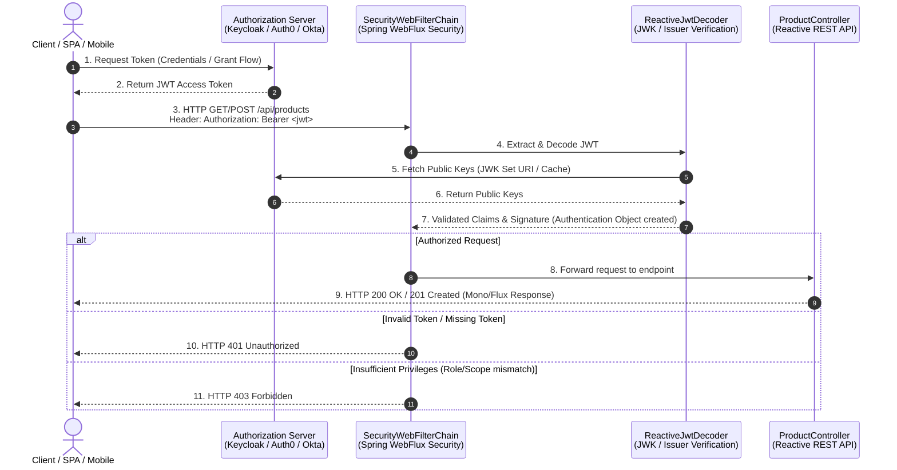

# Spring Security Configuration with OAuth2 + JWT (WebFlux / Reactive)

This document provides a comprehensive guide to configuring **Spring Security with OAuth2 Resource Server & JWT validation** in a **Spring WebFlux (Reactive)** application to secure REST APIs like `ProductController`.

---

## 1. Overview & Security Flow Architecture

In a modern microservices / single-page application (SPA) setup using **OAuth2 + JWT**:
1. The **Client** authenticates with an **Identity Provider / Authorization Server** (e.g., Keycloak, Auth0, Okta, Azure AD, or custom Spring Authorization Server).
2. The Authorization Server issues a signed **JSON Web Token (JWT)** Access Token.
3. The Client calls the Reactive REST API (`ProductController`), passing the token in the `Authorization: Bearer <jwt-token>` HTTP header.
4. **Spring Security WebFlux (Resource Server)** intercepts the request, verifies the JWT signature using the Authorization Server's public keys (via **JWK Set URI** or Issuer URI), extracts granted authorities/roles, and approves or denies access.

---

## 2. Key Terminology & Concepts

| Keyword | Description |
| :--- | :--- |
| **OAuth2 Resource Server** | The backend application hosting protected resources (e.g., `ProductController`) that accepts and validates OAuth2 access tokens. |
| **Authorization Server** | The centralized service responsible for authenticating users and issuing JWT tokens (e.g., Keycloak, Auth0). |
| **JWT (JSON Web Token)** | A compact, URL-safe token format consisting of Header, Payload (claims), and Signature (`header.payload.signature`). |
| **JWK (JSON Web Key) Set** | A set of public cryptographic keys exposed by the Authorization Server used by Resource Servers to verify JWT signatures (`/.well-known/jwks.json`). |
| **SecurityWebFilterChain** | The reactive pipeline of security filters in Spring WebFlux that processes incoming `ServerWebExchange` requests. |
| **ReactiveAuthenticationManager** | The reactive interface in Spring Security WebFlux responsible for authenticating requests (e.g., `JwtReactiveAuthenticationManager`). |
| **ServerHttpSecurity** | The DSL builder for configuring web security in reactive Spring WebFlux applications (counterpart to `HttpSecurity` in Servlet/MVC). |
| **GrantedAuthority** | Represents a permission or role granted to an authenticated principal (e.g., `ROLE_ADMIN`, `SCOPE_read`). |

---

## 3. Important Annotations Reference

| Annotation | Location | Purpose |
| :--- | :--- | :--- |
| `@Configuration` | Security Config Class | Marks the class as a source of bean definitions for the Spring IoC container. |
| `@EnableWebFluxSecurity` | Security Config Class | Enables Spring Security support for WebFlux reactive web applications. |
| `@EnableReactiveMethodSecurity` | Security Config Class | Enables method-level security annotations like `@PreAuthorize` and `@PostAuthorize` in reactive applications. |
| `@Bean` | Config Methods | Registers returned components (such as `SecurityWebFilterChain`, `ReactiveJwtDecoder`) into the Spring application context. |
| `@PreAuthorize` | Controller Methods | Secures specific endpoint methods based on SpEL expressions before method execution (e.g., `@PreAuthorize("hasRole('ADMIN')")`). |
| `@AuthenticationPrincipal` | Controller Method Parameters | Injects the authenticated principal or `Jwt` object directly into controller handler methods. |

---

## 4. Architectural Flowchart (Mermaid)



---

## 5. Application Properties (`application.yml` / `application.properties`)

Add the following properties to configure the OAuth2 Resource Server JWT validation:

### `application.yml`
```yaml
spring:
  security:
    oauth2:
      resourceserver:
        jwt:
          # Option A: Issuer URI (Spring Security automatically discovers JWK Set URI via OpenID Provider Configuration)
          issuer-uri: https://auth.example.com/realms/master
          
          # Option B: Direct JWK Set URI (Use if Authorization Server doesn't expose standard OIDC metadata endpoint)
          # jwk-set-uri: https://auth.example.com/realms/master/protocol/openid-connect/certs

# Optional Custom Logging for Security Debugging
logging:
  level:
    org.springframework.security: DEBUG
    org.springframework.security.oauth2: DEBUG
```

---

## 6. Step-by-Step Implementation Guide

### Step 1: Add Dependencies to `pom.xml`

For a **Spring WebFlux** project, add `spring-boot-starter-oauth2-resource-server`:

```xml
<dependency>
    <groupId>org.springframework.boot</groupId>
    <artifactId>spring-boot-starter-oauth2-resource-server</artifactId>
</dependency>
```

---

## 7. Java Security Configuration Source Code

Create `SecurityConfig.java` under package `com.learn.restapi.config`:

```java
package com.learn.restapi.config;

import org.springframework.context.annotation.Bean;
import org.springframework.context.annotation.Configuration;
import org.springframework.http.HttpMethod;
import org.springframework.core.convert.converter.Converter;
import org.springframework.security.authentication.AbstractAuthenticationToken;
import org.springframework.security.config.annotation.method.configuration.EnableReactiveMethodSecurity;
import org.springframework.security.config.annotation.web.reactive.EnableWebFluxSecurity;
import org.springframework.security.config.web.server.ServerHttpSecurity;
import org.springframework.security.core.GrantedAuthority;
import org.springframework.security.core.authority.SimpleGrantedAuthority;
import org.springframework.security.oauth2.jwt.Jwt;
import org.springframework.security.oauth2.server.resource.authentication.JwtAuthenticationConverter;
import org.springframework.security.oauth2.server.resource.authentication.ReactiveJwtAuthenticationConverterAdapter;
import org.springframework.security.web.server.SecurityWebFilterChain;
import reactor.core.publisher.Mono;

import java.util.Collection;
import java.util.List;
import java.util.Map;
import java.util.stream.Collectors;

/**
 * Security Configuration for Spring WebFlux using OAuth2 Resource Server & JWT.
 * 
 * Defines route permissions for ProductController:
 * - Public read operations: GET /api/products/**
 * - Protected write operations: POST, PUT, DELETE require 'ROLE_ADMIN' or specific scopes.
 */
@Configuration
@EnableWebFluxSecurity
@EnableReactiveMethodSecurity
public class SecurityConfig {

    @Bean
    public SecurityWebFilterChain securityWebFilterChain(ServerHttpSecurity http) {
        return http
            .csrf(ServerHttpSecurity.CsrfSpec::disable)
            .authorizeExchange(exchanges -> exchanges
                // Public endpoints (Swagger UI & OpenAPI docs)
                .pathMatchers("/swagger-ui.html", "/swagger-ui/**", "/v3/api-docs/**", "/webjars/**").permitAll()
                // Public Actuator health check
                .pathMatchers("/actuator/health").permitAll()
                // Allow GET requests on products without authentication (Public Catalog View)
                .pathMatchers(HttpMethod.GET, "/api/products/**").permitAll()
                // Restrict POST, PUT, DELETE on products to users with 'ADMIN' role
                .pathMatchers(HttpMethod.POST, "/api/products/**").hasAuthority("ROLE_ADMIN")
                .pathMatchers(HttpMethod.PUT, "/api/products/**").hasAuthority("ROLE_ADMIN")
                .pathMatchers(HttpMethod.DELETE, "/api/products/**").hasAuthority("ROLE_ADMIN")
                // All other requests require authentication
                .anyExchange().authenticated()
            )
            .oauth2ResourceServer(oauth2 -> oauth2
                .jwt(jwt -> jwt.jwtAuthenticationConverter(grantedAuthoritiesExtractor()))
            )
            .build();
    }

    /**
     * Custom Converter to extract custom roles/claims from JWT payload
     * (e.g. keycloak realm_access.roles or custom claims).
     */
    private Converter<Jwt, Mono<AbstractAuthenticationToken>> grantedAuthoritiesExtractor() {
        JwtAuthenticationConverter jwtAuthenticationConverter = new JwtAuthenticationConverter();
        jwtAuthenticationConverter.setJwtGrantedAuthoritiesConverter(new CustomJwtGrantedAuthoritiesConverter());
        return new ReactiveJwtAuthenticationConverterAdapter(jwtAuthenticationConverter);
    }

    /**
     * Helper Converter to convert JWT claims (scopes/roles) into GrantedAuthority objects.
     */
    static class CustomJwtGrantedAuthoritiesConverter implements Converter<Jwt, Collection<GrantedAuthority>> {
        @Override
        public Collection<GrantedAuthority> convert(Jwt jwt) {
            // Extract standard scopes
            List<String> scopes = jwt.getClaimAsStringList("scope");
            Collection<GrantedAuthority> authorities = scopes != null ? 
                scopes.stream().map(s -> new SimpleGrantedAuthority("SCOPE_" + s)).collect(Collectors.toList()) :
                List.of();

            // Extract custom roles (e.g., Keycloak realm_access -> roles)
            Map<String, Object> realmAccess = jwt.getClaim("realm_access");
            if (realmAccess != null && realmAccess.containsKey("roles")) {
                @SuppressWarnings("unchecked")
                List<String> roles = (List<String>) realmAccess.get("roles");
                authorities.addAll(roles.stream()
                    .map(role -> new SimpleGrantedAuthority("ROLE_" + role))
                    .collect(Collectors.toList()));
            }

            return authorities;
        }
    }
}
```

---

## 8. Secured ProductController Method Security Example

You can also use method security annotations (`@PreAuthorize`) directly inside `ProductController`:

```java
// Example: Method-level authorization in ProductController
@PostMapping
@PreAuthorize("hasRole('ADMIN')")
public Mono<ResponseEntity<Product>> createProduct(
        @Valid @RequestBody Product product,
        @AuthenticationPrincipal Jwt jwt) {
    
    // You can access JWT claims directly from the authenticated user token:
    String userId = jwt.getSubject();
    String userEmail = jwt.getClaimAsString("email");
    
    return productService.createProduct(product)
            .map(created -> ResponseEntity.status(HttpStatus.CREATED).body(created));
}
```

---

## 9. Verification & Testing Steps

1. **Obtain JWT Access Token:**
   ```bash
   curl -X POST "https://auth.example.com/realms/master/protocol/openid-connect/token" \
     -d "client_id=my-app" \
     -d "username=admin_user" \
     -d "password=secret" \
     -d "grant_type=password"
   ```
2. **Access Public GET Endpoint (No Token Required):**
   ```bash
   curl -i http://localhost:8080/api/products
   # Response: HTTP/1.1 200 OK
   ```
3. **Access Protected POST Endpoint Without Token (Fails):**
   ```bash
   curl -i -X POST http://localhost:8080/api/products \
     -H "Content-Type: application/json" \
     -d '{"name":"New Laptop","price":999.99,"category":"Electronics"}'
   # Response: HTTP/1.1 401 Unauthorized
   ```
4. **Access Protected POST Endpoint With Valid Bearer Token (Succeeds):**
   ```bash
   curl -i -X POST http://localhost:8080/api/products \
     -H "Authorization: Bearer <YOUR_JWT_TOKEN>" \
     -H "Content-Type: application/json" \
     -d '{"name":"New Laptop","price":999.99,"category":"Electronics"}'
   # Response: HTTP/1.1 201 Created
   ```
